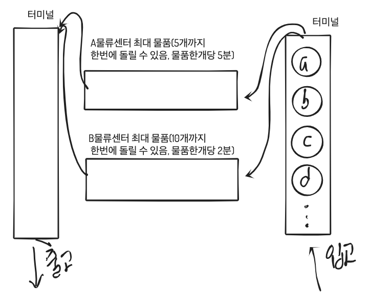

### 환경: mac OS Mojave 10.14, CLion

우리는 프로그래밍언어로 문제를 해결하거나 새로운 기능을 만들 때, 알고리즘을 설계합니다.

알고리즘을 코드로 구현할때 구현한 프로그램이 효과적으로( 빠른시간 안에 동작 || 적은 데이터를 사용하여 ) 동작할 수 있게

많이 알려진 자료구조를 사용하는데, 문제 상황에 맞게 자료구조를 선택하여 구현하면 됩니다.

QUEUE을 설명하고, 큐을 왜 쓰는지에 대해서 그림으로 이해해보고, 큐을 이용한 알고리즘을 슈도코드로 작성하겠습니다.

## 큐 개념:
큐 FIFO (First In First Out)구조의 데이터를 저장할 수 있는 공간입니다.

먼저 들어온 데이터가 먼저 나갑니다. 순서대로 일을 처리할 때 쓰입니다.

가상의 물류센터가 100개의 택배 물품 처리하는데 걸리는 시간을 구하는 시뮬레이션 프로그램을 구현하려고 합니다.

택배가 실제로 어떤 절차로 처리되는지 모릅니다. 큐를 설명하기 위해서 몇 가지 가정을 하겠습니다.


입고 순으로 터미널에 들어가고, 순서대로 A물류 센터, B물류 센터가 있다고 가정하겠습니다.

물류센터가 처음 동작할때 시간을 기록합니다.

A물류센터는 최대 5개 물품이 들어올 수 있고, 한 물품이 처리되는데 5분이 걸립니다.
즉 A물류센터가 처리하는 물품이 5개면 더이상 A물류센터로 들어오지 못하고 기다려야됩니다.

B물류센터는 최대 10개 물품이 들어올 수 있고, 한 물품이 처리되는데 2분이 걸립니다.
마찬가지로 B물류센터가 처리하는 물품이 10개면 더이상 B물류센터로 들어오지 못하고 기다려야됩니다.

그리고 모든 물품이 출고되는 시간을 기록합니다.

## 큐를 사용하면 좋은점:
병렬적으로 여러 물류 센터가 동시에 처리하는 것을 구현할 때 큐가 효과적으로 쓰입니다.
입고되는 터미널, A물류센터, B물류센터, 출고되는 터미널을 각각 큐로 구현하면  
FIFO의 이점을 이용해서 병렬적으로 처리하는 효과를 볼 수 있습니다.

## 슈도코드
```
입고 터미널, A물류센터, B물류센터, 출고 터미널을 의미하는 큐를 각각 생성합니다.
연기되는 물품을 저장하는 대기 터미널 큐도 하나 생성합니다.
시작시간을 기록.

while(true){
    if(현재 출고 터미널에서 빼내온 물품 번호가 100번인가)
        종료시간 기록.
        종료
    if(대기 터미널에 물품이 있는가?) 
        기다리는 물품을 빼냄.
    else if(입고 터미널에 물품이 있으면)    
        입고터미널에서 먼저 들어온 물품을 뺍니다.
    
    if(A물류센터가 현재 처리하는 물품의 개수가 5개 미만인가?)
        A물류센터 큐에 물품 이동
    else if(A물류센터가 현재 처리하는 물품의 개수가 10개 미만인가?)
        B물류센터 큐에 물품 이동
    else     
        대기 터미널에 이동
        
    for(A물류센터에서 처리되는 물품을 순회)
        남은 처리시간을 -1 갱신
        갱신후 남은 처리시간이 0이면 출고 터미널로 이동
    
    for(B물류센터에서 처리되는 물품을 순회)
        갱신후 남은 처리시간이 0이면 출고 터미널로 이동
}
```
